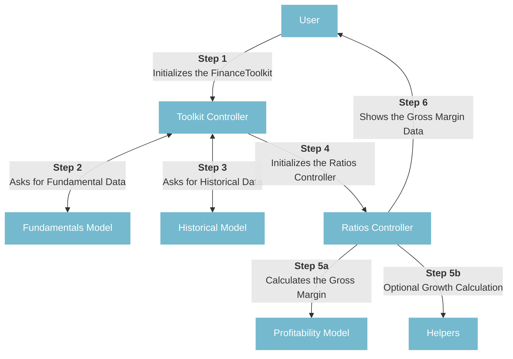

# Contributing
First off all, thank you for taking the time to contribute (or at least read the Contributing Guidelines)! 🚀

The goal of the Finance Toolkit is to make any type of financial calculation as transparent and efficient as possible. I want to make these type of calculations as accessible to anyone as possible and seeing how many websites exists that do the same thing (but instead you have to pay) gave me plenty of reasons to work on this.
___ 

<b><div align="center">Looking to learn how to create and maintain financial models with Python? Have a look at my in-depth guide <a href="https://www.jeroenbouma.com//modelling/introduction">here</a>.</div></b>
___

## Structure

The Finance Toolkit follows the Model, View and Controller (MVC) pattern. This is a pattern in software design commonly used to implement user interfaces, data, and controlling logic. It emphasizes a separation between the software’s business logic and display. This “separation of concerns” provides for a better division of labor and improved maintenance. The Finance Toolkit utilizes only the Controller and Model logic.

- **_controller** modules (such as toolkit_controller and ratios_controller) orchestrate the data flow. Through the controller, the user can set parameters (such as tickers, start and end date) that define the data that needs to be obtained. E.g. in the controller classes you will be able to find the function `get_income_statement` which collects income statements via a **_model** that takes in the parameters set by the user.
- **_model** modules (such as fundamentals_model and historical_model) are the modules that actually obtain the data. E.g in the fundamentals_model exists a function called `get_financial_statements` which would be executed by `get_income_statement` from the controller class to obtain the financial statement, in this case the income statement, for the selected parameters. These functions will also work separately, they do not need the controller to work but the controller needs them to work.

Each model function is categorized in a specific module. For example, the Gross Margin calculation is categorized under the `profitability_model.py` module which contains all of the other profitability ratios. The same applies to the other ratio categories such as liquidity, solvency, efficiency and valuation which can be found in `liquidity_model.py`, `solvency_model.py`, `efficiency_model.py` and `valuation_model.py` respectively.

```python
def get_gross_margin(revenue: pd.Series, cost_of_goods_sold: pd.Series) -> pd.Series:
    """
    Calculate the gross margin, a profitability ratio that measures the percentage of
    revenue that exceeds the cost of goods sold.

    Args:
        revenue (float or pd.Series): Total revenue of the company.
        cost_of_goods_sold (float or pd.Series): Total cost of goods sold of the company.

    Returns:
        float | pd.Series: The gross margin percentage value.
    """
    return (revenue - cost_of_goods_sold) / revenue
```

As seen in my [Financial Modeling with Python Guide](https://www.jeroenbouma.com/modelling/structure-your-model), the Model, View and Controller for Gross Margin calculation will be named `profitability_model.py`, `profitability_view.py` and `profitability_controller.py` respectively. The `helpers.py` module will be placed in the root of the package.

The separation is done so that it becomes possible to call all functions separately making the Finance Toolkit incredibly flexible for any kind of data input. See how this would look like the following example:



## Adding New Functionality

If you are looking to add new functionality do the following:

1. Start by looking at the available modules and whether your functionality would fit inside one of the modules.
    - If the answer is yes, add it to this module.
    - If the answer is no, create a new module and add it there.
2. Figure out whether your functionality would fit with an existing controller. E.g. did you add a new ratio? Consider adding it to the `ratios_controller`.
    - If the answer is yes, add it to this controller.
    - If the answer is no, create a new controller and add it there. Make sure to also connect the controller to the `toolkit_controller` so that it can be called from there.
3. Add in the relevant docstrings (be as extensive as possible, following already created examples) and update the README if relevant.
4. Add in the relevant tests (see `tests` directory for examples). If this is too difficult, feel free to skip.
5. Create a Pull Request with your new additions. See the next section how to do so.

## Working with Git & Pull Requests

Any new contribution preferably goes via a Pull Request. In essence, all you really need is Git and basic understanding of how a Pull Request works. Find some resources that explain this well here:

- [Finding ways to contribute to open source on GitHub](https://docs.github.com/en/get-started/exploring-projects-on-github/finding-ways-to-contribute-to-open-source-on-github)
- [Set up Git](https://docs.github.com/en/get-started/quickstart/set-up-git)
- [Collaborating with pull requests](https://docs.github.com/en/github/collaborating-with-pull-requests)

On every Pull Request, a couple of linters will run (see [here](https://github.com/JerBouma/FinanceToolkit/tree/main/.github/workflows) as well as unit tests for each function in the package. The linters check the code and whether it matches specific coding formatting. The tests check whether running the function returns the expected output. If any of these fail, the Pull Request can not be merged.

## Following the Workflow

After setting up Git, you can fork and pull the project in.

1. Fork the Project ([more info](https://docs.github.com/en/get-started/quickstart/fork-a-repo))
    - **Using GitHub Desktop:** [Getting started with GitHub Desktop](https://docs.github.com/en/desktop/installing-and-configuring-github-desktop/getting-started-with-github-desktop) will guide you through setting up Desktop. Once Desktop is set up, you can use it to [fork the repo](https://docs.github.com/en/desktop/contributing-and-collaborating-using-github-desktop/cloning-and-forking-repositories-from-github-desktop)!
    - **Using the command line:** [Fork the repo](https://docs.github.com/en/github/getting-started-with-github/fork-a-repo#fork-an-example-repository) so that you can make your changes without affecting the original project until you're ready to merge them.
2. Pull the Repository Locally ([more info](https://github.com/git-guides/git-pull))
3. Create your own branch (`git checkout -b feature/contribution`)
4. Install dependencies (see [Setting Up Your Python Environment with `uv`](#setting-up-your-python-environment-with-uv) below)
5. Add your changes (`git add .`)
6. Install pre-commit, this checks the code for any errors before committing (`pre-commit install`)
7. Commit your Changes (`git commit -m 'Improve the Toolkit'`)
8. Check whether the tests still pass (`pytest tests`) and if not, correct then.
    - When no formulas have changed or new tests have been added, you can use `pytest tests --record-mode=rewrite` (please do provide reasoning in this case).
    - If formulas or calculations have changed, adjusts the tests inside the `tests` directory.
9. Push to your Branch (`git push origin feature/contribution`)
10. Open a Pull Request

**Note:** feel free to reach out if you run into any issues: jer.bouma@gmail.com or [LinkedIn](https://www.linkedin.com/in/boumajeroen/) or open a GitHub Issue.

## Setting Up Your Python Environment with `uv`

To ensure a consistent and reproducible development environment, we recommend using [`uv`](https://github.com/astral-sh/uv) for Python virtual environment and dependency management. `uv` is a fast, modern tool that simplifies creating and syncing virtual environments.

You can execute the below script to get going straight away. This script will:

- Prompt you to select a Python version (between 3.10 and 3.14) and create a virtual environment for your project in a central location (`$HOME/uv/virtualenvs/<project_name>`).
- Link the virtual environment to your project folder as `.venv`.
- Sync all dependencies as specified in `pyproject.toml` using [`uv`](https://github.com/astral-sh/uv).
- Add `ipykernel` to development dependencies for Jupyter/VS Code support.
- Configure VS Code to use the new `.venv/bin/python` interpreter automatically.
- Activate the virtual environment and install pre-commit hooks for code quality checks.

Just run the script from your project root (where `pyproject.toml` is located) and follow the prompts. When done, your environment will be ready for development and contribution.

The script can be saved as a bash file (e.g. `set-configs.sh`) and executed with `bash set-configs.sh`.

```bash
#!/usr/bin/env bash

set -e

# 🟩 Python/venv setup
echo "🟩 Installing Uv"
pip install -q uv --disable-pip-version-check

if [ ! -f pyproject.toml ]; then
  echo "❌ pyproject.toml not found in the current directory. Please make sure you are in the project root."
  exit 1
fi

PROJECT_NAME=$(awk -F ' *= *' '
  /^\[project\]/ { in_project=1 }
  in_project && /^name/ { gsub(/["'\'']/, "", $2); print $2; exit }
' pyproject.toml)

if [ -z "$PROJECT_NAME" ]; then
  echo "❌ Could not determine project name from pyproject.toml"
  exit 1
fi

# Determine suggested Python version from requires-python
SUGGESTED_VERSION="3.10"
for v in 3.14 3.13 3.12 3.11 3.10; do
  if [[ "$PY_VERSION_RAW" == *">=$v"* ]]; then
    SUGGESTED_VERSION="$v"
    break
  fi
done

echo "🟩 Suggested Python version: $SUGGESTED_VERSION"
read -p "Enter Python version to use [${SUGGESTED_VERSION}]: " PYTHON_VERSION
PYTHON_VERSION="${PYTHON_VERSION:-$SUGGESTED_VERSION}"

if [[ ! "$PYTHON_VERSION" =~ ^3\.(10|11|12|13|14)$ ]]; then
  echo "❌ Invalid Python version selected. Please choose between 3.10 and 3.14."
  exit 1
fi

VENV_BASE="$HOME/uv/virtualenvs"
VENV_DIR="$VENV_BASE/$PROJECT_NAME"
LINK_NAME=".venv"

echo "🟩 Detected project: $PROJECT_NAME"
echo "🟩 Creating venv at: $VENV_DIR"
echo "🟩 Using Python: $PYTHON_VERSION"

if [ -L "$LINK_NAME" ]; then
  echo "🟩 Removing old .venv symlink..."
  rm "$LINK_NAME"
fi

if [ -d "$VENV_DIR" ]; then
  echo "🟩 Removing existing venv at $VENV_DIR..."
  rm -rf "$VENV_DIR"
fi

echo "🟩 Creating new virtual environment with uv..."
mkdir -p "$VENV_BASE"
uv venv "$VENV_DIR" --python "$PYTHON_VERSION"

echo "🟩 Linking .venv to project folder..."
ln -sf "$VENV_DIR" "$LINK_NAME"

echo "🟩 Syncing dependencies with uv..."
uv sync --python "$PYTHON_VERSION" --no-cache -q

echo "🟩 Adding ipykernel to development dependencies..."
if ! uv add ipykernel --dev --quiet; then
  echo "⚠️ Failed to add ipykernel, continuing setup..."
fi

echo "🟩 Virtual env created and linked! To activate: source .venv/bin/activate"

echo "🟩 Configuring VS Code to use .venv/bin/python..."
mkdir -p .vscode
cat > .vscode/settings.json <<EOF
{
  "python.defaultInterpreterPath": ".venv/bin/python"
}
EOF

echo "🟩 Activating .venv ..."
source .venv/bin/activate

echo "🟧 Installing pre-commit hooks..."
pip install pre-commit -q --no-cache
pre-commit install

echo "✅ Done! Make sure the .venv is selected in the bottom right corner when you open a Python file."
echo "It should say for example '$PYTHON_VERSION.X (venv)'. If it doesn't you can change it by clicking on it."
```
