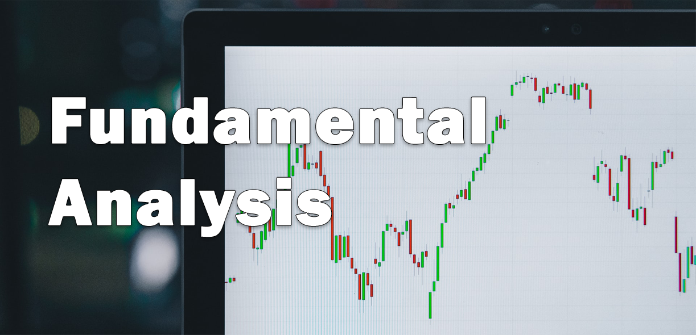

# Fundamental Analysis
This package collects fundamentals and detailed company stock data from a large group of companies (13.000+)
from FinancialModelingPrep and uses Yahoo Finance to obtain stock data for any financial instrument. It allows
the user to do most of the essential fundamental analysis. It also gives the possibility to quickly compare
multiple companies or do a full fledged sector analysis.

See a visualisation of the data on my
[Fundamentals Quantifier website](https://github.com/JerBouma/FundamentalsQuantifier).



## Functions
Here you can find a list of the available functions within this package separated per module. 
- **details**
    - `available companies` - shows the complete list of companies that are available for fundamental data
    gathering. This is an extensive list with well over 13.000 companies.
    - `profile` - gives information about, among other things, the industry, sector exchange
    and company description.
    - `quote` - provides actual information about the company which is, among other things, the day high,
    market cap, open and close price and price-to-equity ratio.
    - `enterprise` - displays stock price, number of shares, market capitalization and 
    enterprise value over time.
    - `rating` - based on specific ratios, provides information whether the company is a (strong) buy,
    neutral or a (strong) sell.
    - `discounted_cash_flow` - calculates the discounted cash flow of a company over time including the
    DCF of today.
- **financial_statement**
    - `income_statement` - collects a complete income statement over time. This can be either quarterly
    or annually. It is limited to 10 years (or 40 quarters).
    - `balance_sheet_statement` - collects a complete balance sheet statement over time. This can be either quarterly
    or annually. It is limited to 10 years (or 40 quarters).
    - `cash_flow_statement` - collects a complete cash flow statement over time. This can be either quarterly
    or annually. It is limited to 10 years (or 40 quarters).
- **ratios**
    - `key_metrics` - lists the key metrics (in total 57 metrics) of a company over time (annual
    and quarterly). This includes, among other things, Return on Equity (ROE), Working Capital,
    Current Ratio and Debt to Assets.
    - `financial_ratios` - includes in-depth ratios (in total 57 ratios) of a company over time (annual
    and quarterly). This contains, among other things, Price-to-Book Ratio, Payout Ratio and Operating Cycle.
    - `financial_statement_growth` - measures the growth of several financial statement items and ratios over
    time (annual and quarterly). These are, among other things, Revenue Growth (3, 5 and 10 years),
    inventory growth and operating cash flow growth (3, 5 and 10 years).
- **stock_data**
    - `stock_data` - collects all stock data (including Close, Adjusted Close, High, Low, Open and Volume) of
    the provided ticker. This can be any financial instrument.
    - `stock_data_detailed` - collects an expansive amount of stock data (including Close, Adjusted Close,
     High, Low, Open, Volume, Unadjusted Volume, Absolute Change, Percentage Change, Volume Weighted
     Average Price (VWAP), Date Label and Change over Time). The data collection is limited to
     the companies listed in the function `available companies`.

## Installation
1. `pip install FundamentalAnalysis`
    * Alternatively, download this repository.
2. (within Python) `import FundamentalAnalysis as fa`

## Example

```
import FundamentalAnalysis as fa

ticker = "AAPL"

# Show the available companies
companies = fa.available_companies()

# Collect general company information
profile = fa.profile(ticker)

# Collect recent company quotes
quotes = fa.quote(ticker)

# Collect market cap and enterprise value
entreprise_value = fa.enterprise(ticker)

# Show recommendations of Analysts
ratings = fa.rating(ticker)

# Obtain DCFs over time
dcf_annual = fa.discounted_cash_flow(ticker, period="annual")
dcf_quarterly = fa.discounted_cash_flow(ticker, period="quarter")

# Collect the Balance Sheet statements
balance_sheet_annually = fa.balance_sheet_statement(ticker, period="annual")
balance_sheet_quarterly = fa.balance_sheet_statement(ticker, period="quarter")

# Collect the Income Statements
income_statement_annually = fa.income_statement(ticker, period="annual")
income_statement_quarterly = fa.income_statement(ticker, period="quarter")

# Collect the Cash Flow Statements
cash_flow_statement_annually = fa.cash_flow_statement(ticker, period="annual")
cash_flow_statement_quarterly = fa.cash_flow_statement(ticker, period="quarter")

# Show Key Metrics
key_metrics_annually = fa.key_metrics(ticker, period="annual")
key_metrics_quarterly = fa.key_metrics(ticker, period="quarter")

# Show a large set of in-depth ratios
financial_ratios = fa.financial_ratios(ticker)

# Show the growth of the company
growth_annually = fa.financial_statement_growth(ticker, period="annual")
growth_quarterly = fa.financial_statement_growth(ticker, period="quarter")

# Download general stock data
stock_data = fa.stock_data(ticker, period="ytd", interval="1d")

# Download detailed stock data
stock_data_detailed = fa.stock_data_detailed(ticker, begin="2000-01-01", end="2020-01-01")

```

With this data you can do a full fledged analysis of the selected company, in this case Apple. However, by writing
a for-loop one can quickly loop over a large selection of companies and collect a bulk of data. Therefore, by 
entering a specific sector (for example, all tickers of the Semi-Conducter industry) you can quickly quantify
the sector and look for key performers. 